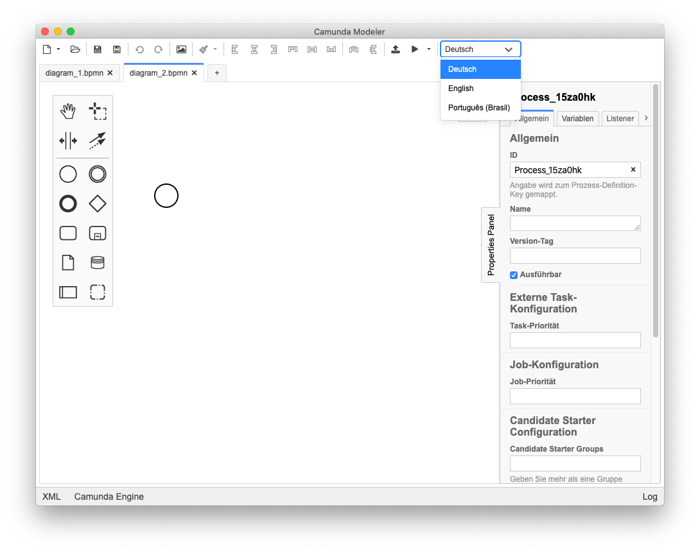

# Camunda Modeler I18N-Plugin
[](https://github.com/camunda/camunda-modeler)

This plugin allows you to translate the UI of the Camunda Modeler. It ships 12 languages - German, English, Spanish, French, Italian, Japanese, Korean, Portuguese (Brasil), Russian, Chinese (Simplified and Traditional) and Dutch - and can be easily extended or customized.

For more information see our blog post (in German): [Internationalization Plugin für den Camunda Modeler](https://www.miragon.io/blog/internationalization-plugin-fur-den-camunda-modeler/) 

See it in action:



## Installation

To use this plugin in your installation, follow these simple steps:

1. Click on releases
2. Download the latest release artifact
3. Extract and move it to the following folder depending on your OS:
   1. Windows: %APPDATA%/camunda-modeler/resources/plugins
   2. Linux: ~/.config/camunda-modeler/resources/plugins
   3. macOS: ~/Library/Application Support/camunda-modeler/resources/plugins
4. Restart the modeler
5. Click on the language dropdown in the toolbar and select the language of your choice, then restart the modeler for the changes to take effect

> Hint: If it does not work for you, make sure you have the correct folder structure:
> ```
> camunda-modeler
> └─ resources
>    └─ plugins
>       └─ i18n (or whatever the folder is called)
>          ├─ index.js
>          └─ dist
> ```
> The `resources` folder is required — the modeler only searches for
> `plugins/*/index.js` underneath it.

## Development

If you want to extend the plugin or provide custom translations or languages, you'll need a working installation of Node.js and a package manager like NPM or yarn. We use NPM in all our examples. Follow these steps:

### Setup

Check the repository out and install all dependencies by using the command `npm install`. You can use any IDE of your choice such as IntelliJ or Visual Studio Code. Every file contains comments that should help you get started.

### Tests

```bash
npm test                     # locale invariants + plugin contract, no modeler needed
npm run check:translations   # report UI strings the Modeler asks for but we do not translate
```

```bash
npx playwright install chromium   # once, for the two suites below
npm run test:integration     # real bpmn-js/dmn-js in a browser
npm run harvest              # re-record the strings the editors ask for

npm run e2e:setup            # download the Camunda Modeler release (~150 MB)
npm run test:e2e             # install the plugin into a real Modeler and check the UI
```

`npm test` covers three things: that all 12 locales stay in sync (same keys, same
`{placeholder}` interpolation), that the built bundle still satisfies the Modeler's plugin
contract, and that we translate every string the Modeler asks for. The contract tests are
what catch a breaking change in `camunda-modeler-plugin-helpers` before a release does.

`npm run check:translations` compares our dictionaries against three sources: the key list
bpmn-js publishes, literal `translate()` calls extracted from the bundles the Modeler loads,
and the strings recorded by `npm run harvest` while driving real editors. The last one matters
because roughly a third of the labels — palette entries, create menus — are built at runtime
and no static analysis can find them.

A weekly workflow reruns all of this against the newest Modeler release and opens (or updates)
a single issue when new strings appear.

### Manual testing in the modeler

To test it, build the plugin by using the command `npm run build`. Copy the following files into the "plugins/i18n" directory (for more see section Installation above):

- `index.js`
- `dist/`

Then restart the modeler to see all changes in effect. If you just changed the translations, opening the devtools via `F12` and pressing `Ctrl-R` or `Cmd+R` is usually enough to reload the plugin. If you changed the menu, you have to restart the modeler, though.

### Automate the local deployment

If you don't want to copy the files manually into the "plugins/i18n" directory all the time, you can automate that using an NPM task. For that, install the package `copyfiles`:

`npm install --dev copyfiles`

Then, add another task in your `package.json` file and adjust the path according to the installation instructions above:

```
"scripts": {
    "local": "npm run build && copyfiles dist/**/*.* index.js 'path/to/plugins/i18n'"
}
```

Make sure that npm has the permissions to copy files into the destination directory.
Now, if you run `npm run local`, the plugin will be built and automatically copied into the destination directory. No more `Ctrl+C` and `Ctrl+V` required!

## Add a new language

If you want to add a new language, follow these steps, after you set up your local development environment:
 
1. Duplicate the "client/bpmnjs-i18n-extension/languages/en" directory and adjust the name (we will use "fr" in this example)
2. Translate the files in the duplicated folder
3. Duplicate the "client/bpmnjs-i18n-extension/languages/en.js" file and adjust the name and the imports inside it so your newly translated files are used:
    ```javascript
    import bpmnJs from './fr/bpmn-js';
    import dmnJs from './fr/dmn-js';
    import propertiesPanel from './fr/properties-panel';
    import other from './fr/other';
    
    // ...
    ```
4. Open the "client/bpmnjs-i18n-extension/translate.js" file, import the new language and add it to the `languages` object:
   ```javascript
   import {config} from '../configuration';
   import de from "./languages/de.js";
   import en from "./languages/en.js";
   import fr from "./languages/fr.js";
   
   const languages = {
       de, en, fr
   };
   
   // ...
   ```
5. Open the "config/I18NPlugin.js" file and add a new entry to the language options:
   ```javascript
   // ...
   const options = [
      // ...
      {value: 'fr', label: 'Français'}
   ]
   // ...
   ```
6. Create a pull request to this repository and help us with adding new languages and improving the existing ones! :)

## Engage with the Miragon team

If you have any questions or need support, feel free to reach out to us via email ([info@miragon.io](mailto:info@miragon.io)).
We are here to help you, especially if you are considering introducing camunda-modeler-i18n-plugin in your organization.

For inquiries and professional support, please contact us at: [info@miragon.io](mailto:info@miragon.io)

## License

Apache License 2.0 — Copyright Miragon GmbH.

See the [LICENSE](LICENSE) file for the full license text and [NOTICE](NOTICE) for attribution.
