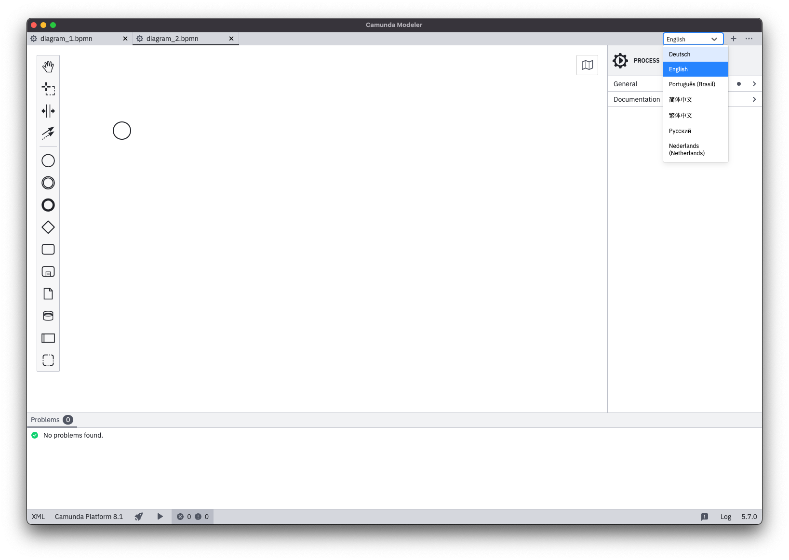

# Camunda Modeler I18N-Plugin
[](https://github.com/camunda/camunda-modeler)

This plugin allows you to translate the UI of the Camunda Modeler. It contains translations for German, English, Portuguese, Chinese, Russian, Chinese (Traditional and Simplified) and Dutch and can be easily extended or customized.

For more information see our blog post (in German): https://www.flowsquad.io/blog/2020-07-15-internationalization-plugin-f%C3%BCr-den-camunda-modeler/ 

See it in action:



## Installation

To use this plugin in your installation, follow these simple steps:

1. Click on releases
2. Download the latest release artifact
3. Extract it and put it inside the "resources/plugins" directory relative to your `{APP_DATA_DIRECTORY}` or `{USER_DATA_DIRECTORY}`.
4. Restart the modeler
5. Click on the language dropdown in the toolbar and select the language of your choice

## Development

If you want to extend the plugin or provide custom translations or languages, you'll need a working installation of Node.js and a package manager like NPM or yarn. We use NPM in all our examples. Follow these steps:

### Setup

Check the repository out and install all dependencies by using the command `npm install`. You can use any IDE of your choice such as WebStorm or Visual Studio Code. Every file contains comments that should help you get started.

### Testing

To test it, build the plugin by using the command `npm run build`. Then, copy the following files into the "resources/plugins" directory (for more see section Installation above):

- `index.js`
- `dist/`
- `menu/`

Then restart the modeler to see all changes in effect. If you just changed the translations, opening the devtools via `F12` and pressing `Ctrl-R` or `Cmd+R` is usually enough to reload the plugin. If you changed the menu, you have to restart the modeler, though.

### Automate the local deployment

If you don't want to copy the files manually into the "resources/plugins" directory all the time, you can automate that using an NPM task. For that, install the package `copyfiles`:

`npm install --dev copyfiles`

Then, add another task in your `package.json` file:

```
"scripts": {
    "local": "npm run bundle && copyfiles dist/**/*.* index.js menu/**/*.* 'path/to/modeler/resources/plugins/i18n'"
}
```

Now, if you run `npm run local`, the plugin will be built and automatically copied into the destination directory. No more `Ctrl+C` and `Ctrl+V` required!

## Add a new language

If you want to add a new language, follow these steps, after you set up your local development environment:
 
1. Duplicate the "client/bpmnjs-i18n-extension/languages/en" directory and adjust the name (we will use "fr" in this example)
2. Translate the files in the duplicated folder
3. Duplicate the "client/bpmnjs-i18n-extension/languages/en.js" file and adjust the name and the imports inside it so your newly translated files are used:
    ```javascript
    import bpmnJs from './fr/bpmn-js';
    import dmnJs from './fr/dmn-js';
    import propertiesPanel from './fr/properties-panel';
    import other from './fr/other';
    
    // ...
    ```
4. Open the "client/bpmnjs-i18n-extension/translate.js" file, import the new language and add it to the `languages` object:
   ```javascript
   import {config} from '../configuration';
   import de from "./languages/de.js";
   import en from "./languages/en.js";
   import fr from "./languages/fr.js";
   
   const languages = {
       de, en, fr
   };
   
   // ...
   ```
5. Open the "config/I18NPlugin.js" file and add a new entry to the language options:
   ```javascript
   // ...
   const options = [
      // ...
      {value: 'fr', label: 'Français'}
   ]
   // ...
   ```
6. Create a pull request to this repository and help us with adding new languages and improving the existing ones! :)
   
## License

```
/**
 * Copyright 2021 FlowSquad GmbH
 *
 * Licensed under the Apache License, Version 2.0 (the "License");
 * you may not use this file except in compliance with the License.
 * You may obtain a copy of the License at
 *
 * http://www.apache.org/licenses/LICENSE-2.0
 *
 * Unless required by applicable law or agreed to in writing, software
 * distributed under the License is distributed on an "AS IS" BASIS,
 * WITHOUT WARRANTIES OR CONDITIONS OF ANY KIND, either express or implied.
 * See the License for the specific language governing permissions and
 * limitations under the License.
 */
```

For the full license text, see the LICENSE file above.
